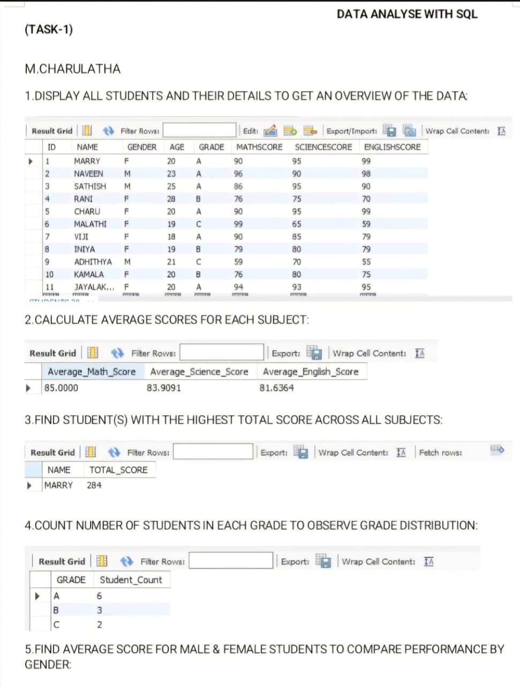
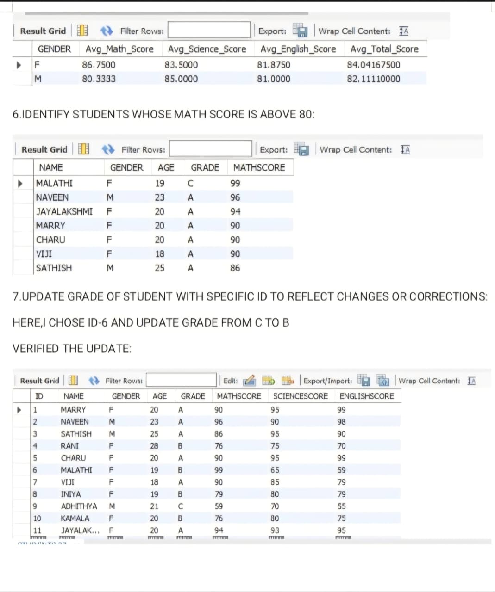
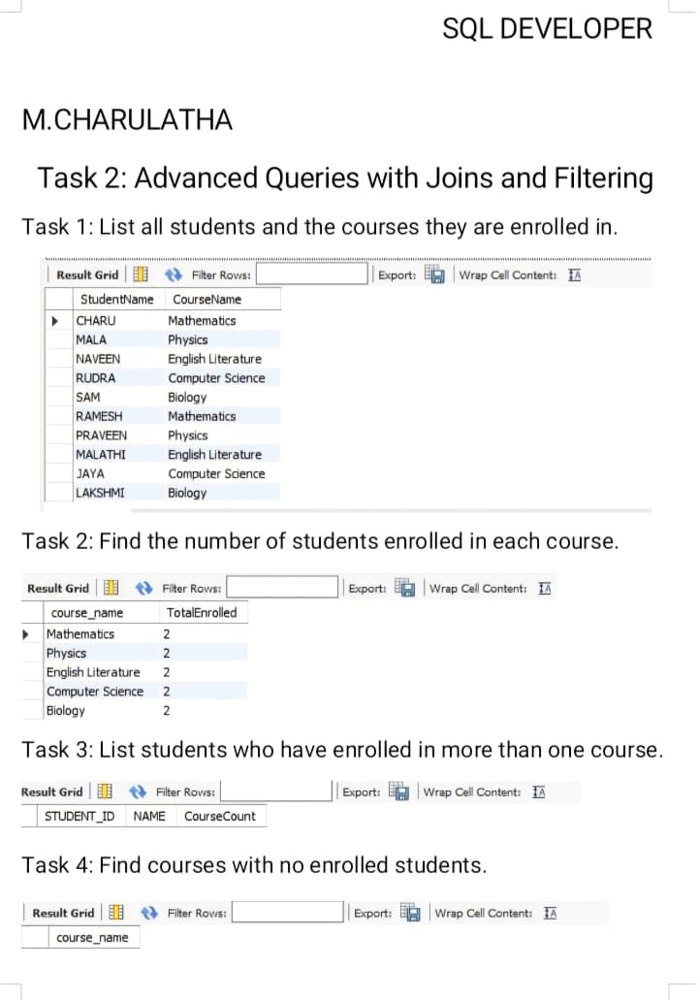
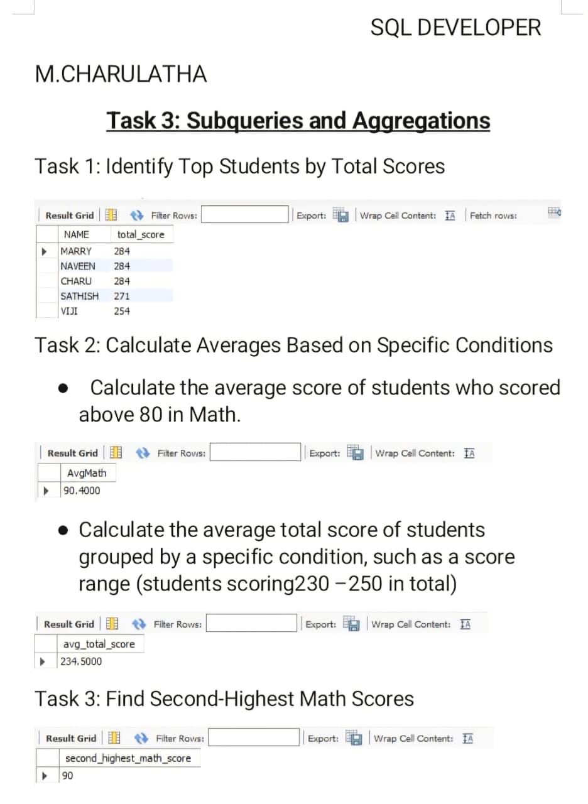
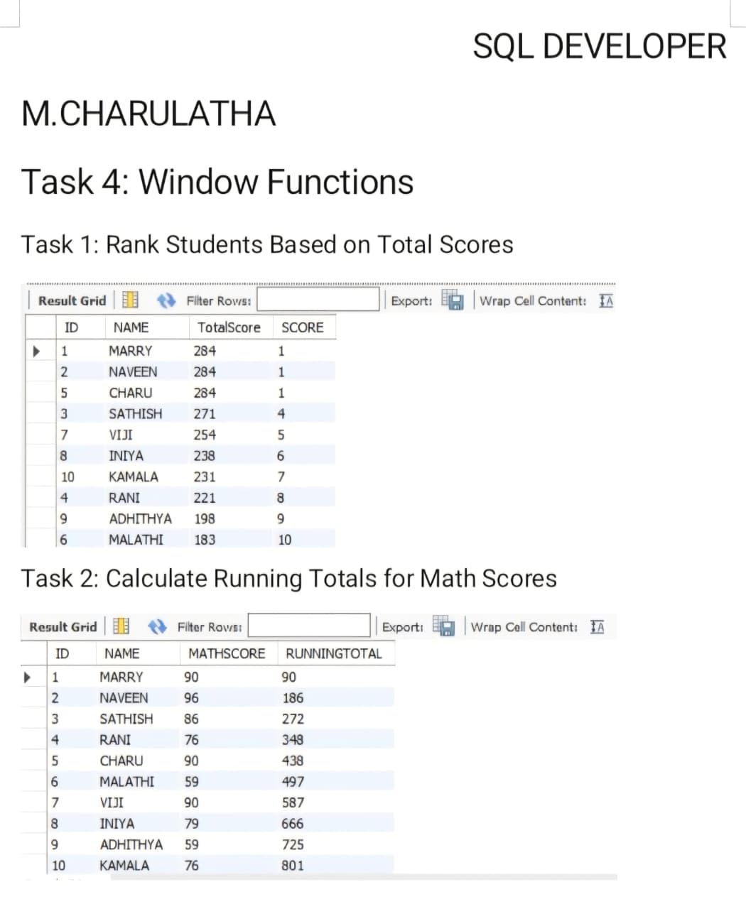

# SQL Data Analysis Internship — Main Flow Services and Technologies 🗄️

**Intern:** M. Charulatha | MSc Bioinformatics and Data Science  
**Organisation:** Main Flow Services and Technologies Pvt. Ltd.  
**Internship ID:** 16678  
**Duration:** 15 March 2025 – 15 April 2025  
**Tool:** MySQL Workbench

> This repository contains task output screenshots and the completion certificate
> from my SQL Data Analysis internship. Tasks were completed week by week in MySQL
> Workbench. Screenshots capture the query results for each task.

---

## Internship Certificate

---

## Tasks Overview

| Task | Topic | Concepts Applied |
|---|---|---|
| Task 1 | Student Data Analysis | SELECT, AVG, COUNT, GROUP BY, UPDATE, WHERE |
| Task 2 | Advanced Queries with Joins and Filtering | INNER JOIN, GROUP BY, subqueries |
| Task 3 | Subqueries and Aggregations | Nested queries, conditional averages, HAVING |
| Task 4 | Window Functions | RANK(), SUM() OVER(), running totals |

---

## Task 1 — Student Data Analysis

**Dataset:** Student table — ID, Name, Gender, Age, Grade, MathScore, ScienceScore, EnglishScore

**Questions answered:**
- Display all students and their details
- Calculate average scores for each subject
- Find student(s) with the highest total score across all subjects
- Count number of students in each grade — grade distribution
- Compare average scores by gender (male vs female)
- Identify students whose Math score is above 80
- Update a student's grade by ID and verify the change

**Output:**

---

## Task 2 — Advanced Queries with Joins and Filtering

**Dataset:** Students table + Courses table + Enrollment table (many-to-many relationship)

**Questions answered:**
- List all students and the courses they are enrolled in
- Find the number of students enrolled in each course
- List students who have enrolled in more than one course
- Find courses with no enrolled students

**Output:**

---

## Task 3 — Subqueries and Aggregations

**Questions answered:**
- Identify top students by total scores using subqueries
- Calculate average Math score only for students who scored above 80
- Calculate average total score for students in the 230–250 score range
- Find the second-highest Math score

**Output:**

---

## Task 4 — Window Functions

**Questions answered:**
- Rank students based on total scores using `RANK()`
- Calculate running totals for Math scores using `SUM() OVER()`

**Output:**

---

## Key Learnings from This Internship

1. **Structured task-based learning** — each week introduced a new concept building on the previous one, which reinforced understanding progressively
2. **JOINs on real relationships** — connecting students to courses through an enrollment table taught how many-to-many relationships work in practice
3. **Subqueries for complex filtering** — finding second-highest scores and conditional group averages requires thinking in layers, not just flat queries
4. **Window functions are different from GROUP BY** — `RANK()` and `SUM() OVER()` preserve individual rows while still computing across groups — this distinction is important for analytics roles
5. **UPDATE with verification** — always re-query after an UPDATE to confirm the change landed correctly; this is a real-world data hygiene habit
6. **Reading query outputs critically** — interpreting what a result table is telling you (e.g. spotting that three students tied for rank 1) is as important as writing the query itself

---

## Files in This Repository

| File | Description |
|---|---|
| `task1_output1.png` | Task 1 query results — student overview and aggregates |
| `task1_output2.png` | Task 1 continued — gender comparison, filter, update |
| `task2_output.png` | Task 2 — joins and enrollment queries |
| `task3_output.png` | Task 3 — subqueries and conditional aggregations |
| `task4_output.png` | Task 4 — window function results |
| `certificate.png` | Internship completion certificate |
| `README.md` | Repository overview |

---

## Organisation

**Main Flow Services and Technologies Pvt. Ltd.**  
Registered under Ministry of Corporate Affairs, Government of India  
Recognised by Ministry of MSME, Govt. of India

